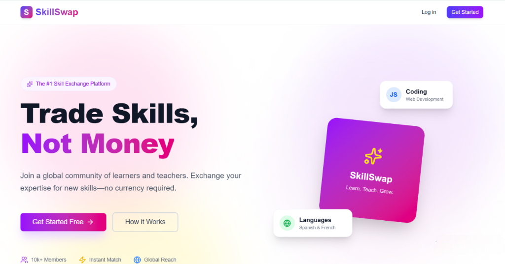

# SkillSwap 🤝



SkillSwap is a community-driven platform designed to facilitate skill exchange between users. Connect with others, offer your expertise, request new skills, and grow together in a collaborative environment.


---

## 📑 Table of Contents

- [Features](#-features)
- [Tech Stack](#-tech-stack)
- [Getting Started](#-getting-started)
- [Project Structure](#-project-structure)
- [Scripts](#-scripts)
- [Contributing](#-contributing)
- [License](#-license)

---

## ✨ Features

- **User Authentication**: Secure login and registration system using NextAuth.js.
- **Skill Management**: 
  - **Offers**: Users can post skills they want to teach or share.
  - **Requests**: Users can browse and book skills they want to learn.
- **Interactive Dashboard**: Track your credits, bookings, and platform activity.
- **Real-time Communication**: Integrated real-time chat and notifications using Socket.io.
- **Credit System**: Economy-based system to manage exchanges fairly.
- **Search & Discovery**: Find the right skills with advanced search and filtering.
- **Responsive Design**: Modern, mobile-first UI built with Tailwind CSS.

---

## 🛠 Tech Stack

### Frontend
- **Framework**: [Next.js 16](https://nextjs.org/) (App Router)
- **Language**: [TypeScript](https://www.typescriptlang.org/)
- **Styling**: [Tailwind CSS v4](https://tailwindcss.com/) & [Framer Motion](https://www.framer.com/motion/)
- **Icons**: [Lucide React](https://lucide.dev/)
- **Notifications**: [React Hot Toast](https://react-hot-toast.com/) & [SweetAlert2](https://sweetalert2.github.io/)

### Backend
- **Database**: [MongoDB](https://www.mongodb.com/) with [Mongoose](https://mongoosejs.com/)
- **API**: Next.js API Routes
- **Real-time**: [Socket.io](https://socket.io/) (Custom server setup)
- **Authentication**: [NextAuth.js](https://next-auth.js.org/)
- **Image Upload**: Cloudinary (inferred)
- **Validation**: [Zod](https://zod.dev/)

---

## 🚀 Getting Started

Follow these steps to set up the project locally.

### Prerequisites

Ensure you have the following installed:
- [Node.js](https://nodejs.org/) (v18+ recommended)
- [MongoDB](https://www.mongodb.com/try/download/community) (Local or Atlas)
- Package Manager: `npm`, `yarn`, `pnpm`, or `bun`

### Installation

1. **Clone the repository:**
   ```bash
   git clone https://github.com/OmarIsmailIT/skillswap.git
   cd skillswap
   ```

2. **Install dependencies:**
   ```bash
   npm install
   ```

3. **Set up Environment Variables:**
   Create a `.env.local` file in the root directory and add the following variables:

   ```env
   # Database
   MONGODB_URI=mongodb://localhost:27017/skillswap

   # Authentication (NextAuth)
   NEXTAUTH_URL=http://localhost:3000
   NEXTAUTH_SECRET=your_super_secret_key

   # Socket.io & App
   PORT=3000
   NEXT_PUBLIC_APP_URL=http://localhost:3000

   # Cloudinary (Image Uploads)
   CLOUDINARY_CLOUD_NAME=your_cloud_name
   CLOUDINARY_API_KEY=your_api_key
   CLOUDINARY_API_SECRET=your_api_secret
   ```

4. **Seed the Database (Optional but Recommended):**
   Populate the database with initial test data (users, skills, bookings).
   ```bash
   npm run seed
   ```

5. **Run the Development Server:**
   This project uses a custom server setup to support Socket.io.
   ```bash
   npm run dev
   ```

   Open [http://localhost:3000](http://localhost:3000) in your browser.

---

## 📂 Project Structure

```bash
skillswap/
├── src/
│   ├── app/                # Next.js App Router pages and API routes
│   │   ├── api/            # Backend API endpoints (Auth, Socket, Uploads)
│   │   ├── dashboard/      # User dashboard pages
│   │   ├── offers/         # Skill offers pages
│   │   ├── skills/         # Skill listing pages
│   │   └── ...
│   ├── components/         # Reusable UI components
│   ├── contexts/           # React Contexts (e.g., SocketContext)
│   ├── data/               # Static JSON data for seeding
│   ├── lib/                # Utility functions, DB connection, Auth config
│   ├── models/             # Mongoose database models (User, SkillOffer, etc.)
│   ├── scripts/            # Script files (e.g., Database Seeder)
│   ├── styles/             # Global styles
│   └── types/              # TypeScript type definitions
├── public/                 # Static assets (images, icons)
├── server.mjs              # Custom Node.js server for generic Socket.io support
├── .env.local              # Environment variables (not committed)
└── package.json            # Project dependencies and scripts
```

---

## 📜 Scripts

| Script | Description |
| :--- | :--- |
| `npm run dev` | Starts the development server with Socket.io support. |
| `npm run build` | Builds the application for production. |
| `npm run start` | Starts the production server. |
| `npm run lint` | Runs ESLint to check for code quality issues. |
| `npm run seed` | Seeds the MongoDB database with initial data. |

---

## 🤝 Contributing

Contributions are welcome! Please feel free to submit a Pull Request.

1. Fork the project
2. Create your feature branch (`git checkout -b feature/AmazingFeature`)
3. Commit your changes (`git commit -m 'Add some AmazingFeature'`)
4. Push to the branch (`git push origin feature/AmazingFeature`)
5. Open a Pull Request

---

## 📝 License

This project is licensed under the MIT License.
